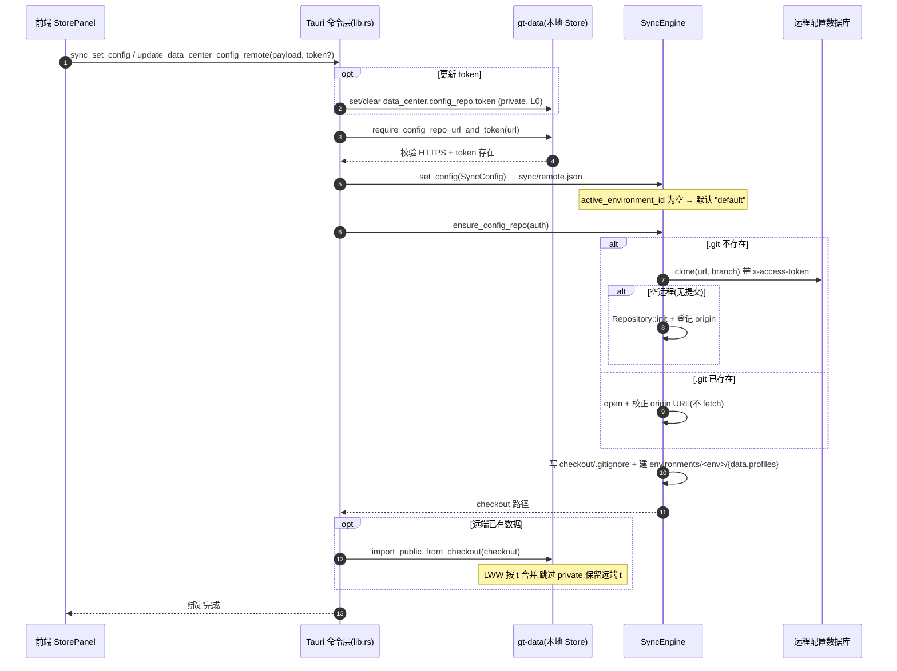
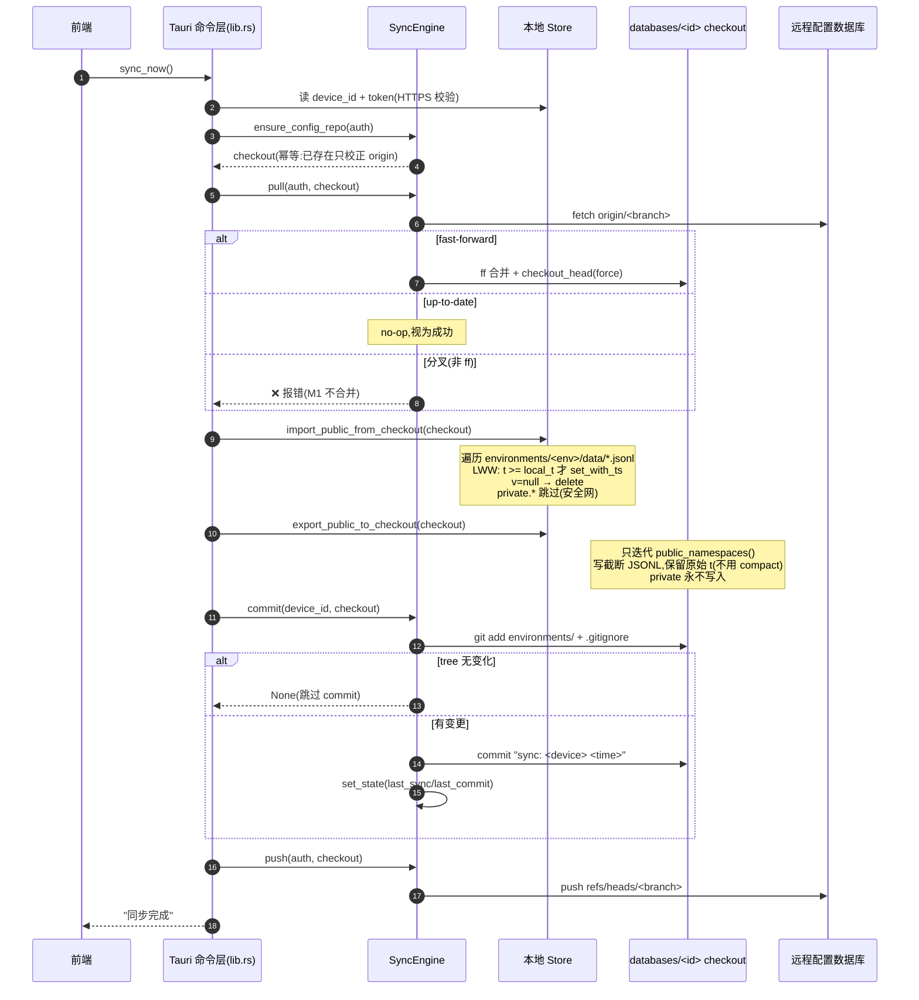
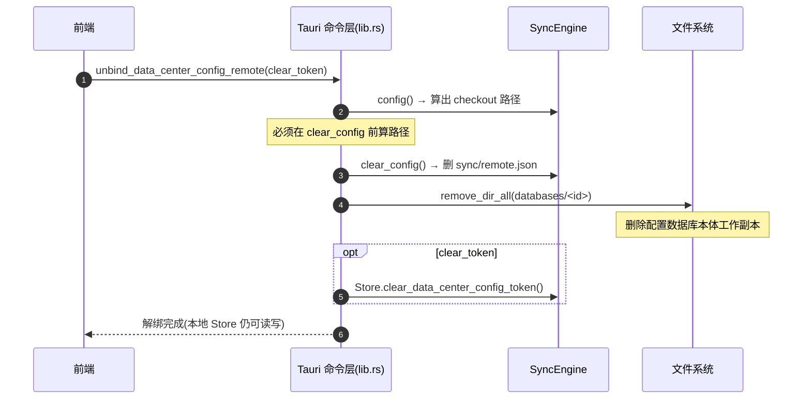

# 数据中心远程同步设计

> 本文档讨论 GitTributary 数据中心的远程同步补齐方案。
> 目标:基于 GitHub 仓库完成 `~/.git-tributary/` 的跨端配置同步,同时保持模块职责清晰。

> **实现阶段(2026-06-25)**:
> - **Phase 1(已实现,传输模型)**:Store 本体仍在 `~/.git-tributary/data/`;远程配置数据库 clone 到 `~/.git-tributary/databases/<repo-name>-<url-hash>/`(配置数据库本体,不是缓存)。sync 在 checkout 上执行 `pull → import(LWW) → export → commit → push`,通过 export/import 在 Store 与 checkout 的 `environments/<env>/data/` 之间搬运 public 数据。private 靠 export 过滤 + checkout `.gitignore` 双保险。非 ff 直接报错。环境切换 UI 仍走本地 profile,未接到 sync env(默认 `default`)。
> - **Phase 2(待实现,re-root 模型)**:Store 按可见性分流,public 命名空间 `data_dir` 直接指向 checkout 的 `environments/<env>/data/`;private 物理迁到 `~/.git-tributary/local/data/`(永不进 checkout);`~/.git-tributary/` 不再是 git 仓库;环境切换变 reroot。彻底消除"checkout clone 了没人用"与 credential 物理隔离两缺口。

---

## 一、问题背景

当前数据中心已经有 JSONL、命名空间、环境配置(Profile 兼容实现)和基础同步代码,但同步功能仍有几个关键缺口:

1. 数据中心没有绑定一个明确的"配置数据库"。
2. 同步配置里直接保存远程 URL/分支,没有复用 Git 模块已有的远程、认证、仓库配置能力。
3. `gt-data::sync` 直接使用 `git2` 执行 init/pull/push,职责越过了数据中心边界。
4. 多端同时修改时,缺少事件、定时同步、冲突处理和并发约束的完整设计。

新的设计原则:

| 模块 | 职责 |
| --- | --- |
| `gt-git` | 管理 GitHub 远程仓库配置、认证、仓库标签,并提供 clone/fetch/pull/push 等 Git 操作接口 |
| `gt-data` | 管理 `.git-tributary` 配置数据、命名空间、环境配置、同步策略、数据合并,并编排配置同步 |
| `gt-flow`/调度层 | 监听事件、定时触发同步任务、串行化任务执行 |
| 前端数据中心面板 | 选择配置数据库、查看同步状态、触发手动同步、展示冲突 |

一句话:数据中心负责"什么时候同步、同步哪个配置数据库、clone 到哪里、哪些 `.git-tributary` 数据需要合并";Git 模块负责"给定远程、认证和本地路径后,如何安全执行 Git 操作"。

---

## 二、核心概念

### 2.1 配置数据库(Config Database)

配置数据库是一个由数据中心选择和编排、由 Git 模块执行 Git 操作的 Git 仓库,用于承载 GitTributary 的公共配置数据:

```
<config-db-worktree>/
├── environments/
│   ├── test/
│   │   ├── data/
│   │   ├── profiles/
│   │   └── sync/
│   ├── staging/
│   │   ├── data/
│   │   ├── profiles/
│   │   └── sync/
│   └── prod/
│       ├── data/
│       ├── profiles/
│       └── sync/
├── sync/
│   └── database-meta.json
└── .git/
```

它可以是一个专门的 GitHub private repo,例如:

```text
https://github.com/ChenXuRiYue/gt-config.git
```

也可以是 Git 模块中已经配置好的某个仓库条目,但必须被标记为"配置数据库"用途。

### 2.2 远程仓库与环境配置

产品上要分成两层:

1. 先确定一个远程同步仓库。它是配置中心容器,负责承载 GitTributary data-center 的远端数据。
2. 这个远程仓库内可以有多套并行、独立的环境配置,例如 `test`、`staging`、`preview`、`prod`。环境之间像 Java 的配置 profile 一样切换,但它们仍属于同一个配置中心仓库。

因此"命名空间"和"环境配置"不是同一层级:

- 左侧命名空间仍是一级配置域,例如 `settings`、`workspace`、`ui-state`、插件域。
- 环境配置是数据空间维度,用于决定当前看到和同步的是哪一套配置快照。
- private/public 是每套环境内部的数据分层,不是左侧一级域。

远端建议结构:

```text
environments/<environment-id>/data/*.jsonl
environments/<environment-id>/profiles/*.jsonl
environments/<environment-id>/sync/state.json
sync/database-meta.json
```

M1 本地可以继续复用现有 `profiles/` 能力承载环境快照,但 UI、规范和对外 API 应使用"环境配置"语义。后续落地远端工作区时,再迁移到 `environments/<id>/` 目录,避免 test/prod 在同一组 JSONL 中互相污染。

### 2.3 当前只能选择一个远程仓库

M1 阶段只支持一个激活的配置数据库:

```json
{
  "active_database_id": "github:ChenXuRiYue/gt-config",
  "active_environment_id": "staging",
  "enabled": true,
  "auto_sync": true,
  "interval_seconds": 300
}
```

原因:

- 数据中心当前是全局 `~/.git-tributary/`,不是多租户 Store。
- 同一时间多个配置数据库会带来命名空间路由、环境叠加和冲突归属问题。
- 先把"一个配置数据库稳定同步"做扎实,后续再扩展多数据库。

### 2.4 数据库不是普通最近仓库

Git 模块已有"最近仓库/远程列表"能力需要升级为"仓库登记表",并支持标签化:

| 字段 | 示例 | 说明 |
| --- | --- | --- |
| `id` | `github:ChenXuRiYue/gt-config` | 稳定 ID |
| `name` | `GitTributary Config` | 展示名 |
| `remote_url` | `https://github.com/ChenXuRiYue/gt-config.git` | 远程 URL |
| `default_branch` | `main` | 默认同步分支 |
| `provider` | `github` | 远程服务商 |
| `visibility` | `private` | public/private/internal |
| `tags` | `["config-db","github","personal"]` | 用途标签 |
| `auth_profile_id` | `data_center.config_repo.token` | 配置中心专用 token 引用 |
| `last_checked_at` | `2026-06-24T10:00:00+08:00` | 最近连通性检查 |
| `health` | `ok` | ok/auth_failed/offline/conflict |

这里不要求 Git 模块为配置数据库提供 `local_path`。普通内容仓库可以有自己的工作区路径,但配置数据库的 checkout 位置由数据中心决定,例如 `~/.git-tributary/databases/<database-id>/`。

数据中心选择配置数据库时,只从 Git 模块返回的候选列表中选择:

```rust
gt_git.list_registered_repos(filter: tag = "config-db")
```

如果没有候选,前端从数据中心入口发起"创建/导入配置数据库"流程,但 GitHub 仓库创建、认证和远程登记仍调用 Git 模块完成,而不是在数据中心里直接填 GitHub URL。

---

## 三、职责边界

本设计遵守 `数据流与响应链路规范.md` 中的强制约束:data-center 数据的存储、拉取、同步、合并只由数据引擎(`gt-data`)实现;Git 仓库操作原语和 Git 事件信号由 Git 模块(`gt-git`)实现。

配置中心仓库还有一条额外强制约束:只能使用显式配置的配置中心专用 Access Token。配置中心承载 GitTributary 内部 data-center 数据,并会在数据引擎中执行 clone、拉取、提交、推送等同步动作,因此不能隐式依赖系统 Git 凭据、SSH Agent、普通仓库 SSH Key 或 Git 模块的全局 token。Token 只在本机 `private.credentials/data_center.config_repo.token` 保存,不进入 public 配置与远端仓库。

配置中心仓库配置必须支持在线验证,交互类似数据库配置里的 Connect 按钮:

- 验证只检查 URL 格式、Token 是否存在、远端仓库是否可访问、默认分支/refs 是否可读取。
- 验证不保存配置、不 clone、不 fetch 到本地、不 pull、不 push。
- 验证必须使用配置中心专用 token;不能回退到系统 Git 凭据。
- 验证失败需要区分 `invalid_url`、`missing_token`、`auth_failed`、`not_found`、`network_failed` 等状态,前端展示可行动提示。
- 保存并绑定前不强制必须验证成功,但 UI 应提供清晰的验证入口和最近一次验证结果。

保存并绑定成功后,该配置中心仓库必须进入 Git 模块的远程仓库配置视图,作为 GitTributary 级远程配置可见、可管理:

- `source = gittributary_config`
- `purpose = data_center_sync`
- `credential_mode = config_repo_token`
- 不能伪装成当前工作仓库的 `.git/config` remote。
- Git 远程页可以展示、验证、修改配置引用,但复杂仓库操作仍暂不对外暴露。

### 3.1 Git 模块新增/增强能力

Git 模块需要提供面向同步的领域接口,而不是让数据中心直接使用 `git2`:

```rust
pub struct RegisteredRepo {
    pub id: String,
    pub name: String,
    pub remote_url: Option<String>,
    pub default_branch: String,
    pub tags: Vec<String>,
    pub auth_profile_id: Option<String>,
    pub health: RepoHealth,
}

pub enum SyncMode {
    FetchOnly,
    PullFastForward,
    PushCurrentBranch,
}

pub trait GitRepositoryRegistry {
    fn list_registered_repos(&self, filter: RepoFilter) -> Result<Vec<RegisteredRepo>>;
    fn tag_repo(&mut self, repo_id: &str, tags: Vec<String>) -> Result<()>;
    fn check_remote_health(&self, repo_id: &str) -> Result<RepoHealth>;
    fn resolve_remote(&self, repo_id: &str) -> Result<RemoteSpec>;
}

pub trait GitSyncService {
    fn clone_to(&self, remote: &RemoteSpec, local_path: &Path) -> Result<GitSyncReport>;
    fn open_at(&self, local_path: &Path) -> Result<GitRepoHandle>;
    fn fetch(&self, repo: &GitRepoHandle) -> Result<GitSyncReport>;
    fn pull_ff(&self, repo: &GitRepoHandle, branch: &str) -> Result<GitSyncReport>;
    fn commit_paths(&self, repo: &GitRepoHandle, paths: &[PathBuf], message: &str) -> Result<Option<String>>;
    fn push(&self, repo: &GitRepoHandle, branch: &str) -> Result<GitSyncReport>;
}
```

Git 模块负责:

- GitHub URL、SSH/PAT/credential helper。
- 仓库登记、标签、远程配置解析。
- 给定 `local_path` 后执行 clone/open/fetch/pull/push。
- remote origin 创建与更新。
- fast-forward 判断。
- 认证错误、网络错误、远程不存在等 Git 语义错误。
- 仓库标签和候选配置数据库列表。
- 配置中心远程只读验证能力,例如 `check_remote_access(url, token)`。

### 3.2 数据中心保留能力

数据中心负责:

- 读写当前环境下的 `data/*.jsonl`、`profiles/*`、`sync/*.json`。
- 判断哪些命名空间可同步。
- 保存 active config database ID。
- 保存 active environment ID。
- 决定配置数据库 checkout 路径,并在缺失时调用 Git 模块 clone。
- 将本地 Store 物化到配置数据库工作区。
- 从配置数据库工作区加载远端数据。
- 按 JSONL 语义合并同 key 记录。
- 更新同步状态。
- 发出 `store:changed` / `store:sync:*` 事件。

数据中心不做:

- 不直接复用普通 GitHub token;配置中心只读取 data-center 专用 token。
- 不直接发明 remote URL,只引用 Git 模块登记的远程配置。
- 不直接构造 `git2::RemoteCallbacks`。
- 不直接使用 `git2` push/pull,但负责调用 Git 模块的 push/pull 接口。
- 不把 `credentials/`、`cache/` 同步到远端。

---

## 四、配置数据库选择流程

### 4.1 首次启用

```
用户进入数据中心 / 同步
    ↓
前端调用 git_list_registered_repos(tag = "config-db")
    ↓
若有候选:展示候选列表
若无候选:数据中心发起创建/导入流程,Git 模块完成 GitHub 与远程登记操作
    ↓
用户选择一个配置数据库
    ↓
数据中心保存 active_database_id
    ↓
数据中心计算 database_checkout_path
    ↓
数据中心调用 Git 模块 clone_to/open_at
    ↓
数据中心初始化/校验数据库目录结构
    ↓
执行一次 sync_now
```

### 4.2 Git 模块中的仓库标签

需要支持更丰富的标签,为后续能力铺路:

| 标签 | 含义 |
| --- | --- |
| `config-db` | 可被数据中心选为配置数据库 |
| `note-repo` | 用户内容仓库 |
| `backup-target` | 可作为自动备份目标 |
| `pages-target` | GitHub Pages 发布目标 |
| `readonly` | 只读仓库,不允许 push |
| `private` | 远程仓库为私有 |
| `trusted` | 用户信任,可自动同步 |

标签归 Git 模块所有,数据中心只消费 `config-db` 这一类。

### 4.3 数据中心本地配置

建议放在 `~/.git-tributary/sync/database.json`:

```json
{
  "active_database_id": "github:ChenXuRiYue/gt-config",
  "active_environment_id": "staging",
  "database_checkout_path": "~/.git-tributary/databases/gt-config-<url-hash>",
  "enabled": true,
  "auto_sync": true,
  "interval_seconds": 300,
  "sync_on_startup": true,
  "sync_on_shutdown": true,
  "last_selected_at": "2026-06-24T10:00:00+08:00"
}
```

这个文件是本机对"选哪个数据库、clone/cache 到哪里"的偏好。M1 可不参与远程同步,避免一台设备切换数据库后影响其他设备。

配置中心仓库本身必须落地为本地独立 git 工作副本(配置数据库本体,不是可丢弃 cache)。默认路径由数据中心按远程 URL 稳定分配:

```text
~/.git-tributary/databases/<repo-name>-<url-hash>/
```

这个目录是配置数据库的本地工作副本,**删除等于丢数据**(除非远端另有备份);它代表当前配置中心仓库的本地工作区。数据中心负责创建、定位、清理和决定何时对它执行同步;Git 模块只在数据中心传入 `local_path` 后执行 clone/open/fetch/pull/push 等仓库原语。

配置中心仓库绑定成功后,数据中心必须立即拉取远程仓库到该本地 checkout。后续拿取远程配置、修改远程配置、提交与同步,都围绕这个 checkout 进行;远程 URL 只用于初始化/校准 `origin` 和联网同步,不再作为无状态配置读取入口。

远端配置数据库内可以保存 `sync/database-meta.json`,用于描述该仓库本身:

```json
{
  "schema_version": 1,
  "database_id": "github:ChenXuRiYue/gt-config",
  "created_by": "GitTributary",
  "created_at": "2026-06-24T10:00:00+08:00"
}
```

---

## 五、同步数据范围

### 5.1 同步

| 路径 | 说明 |
| --- | --- |
| `data/*.jsonl` | public 命名空间 |
| `data/plugins/**/*.jsonl` | 插件 public 配置 |
| `profiles/*.jsonl` | 环境配置兼容快照 |
| `profiles/_active.json` | 当前激活环境指针,是否同步可配置 |
| `sync/database-meta.json` | 数据库元信息 |

远端多环境模式下,上述路径都位于 `environments/<environment-id>/` 内。环境之间不能共享 `data/*.jsonl`;需要共享的全局元信息只能放在仓库级 `sync/database-meta.json` 或后续明确的 `shared/` 区域。

### 5.2 不同步

| 路径 | 说明 |
| --- | --- |
| `credentials/` | 永不离开本机 |
| `cache/` | 可重建缓存 |
| `sync/last-sync.json` | 本机状态 |
| `sync/locks/` | 本机同步锁 |
| `*.tmp` | 临时文件 |

配置数据库工作区的 `.gitignore` 必须包含:

```gitignore
credentials/
cache/
sync/last-sync.json
sync/locks/
*.tmp
```

---

## 六、同步流程

### 6.1 手动同步

```
store.sync_now()
    ↓
获取 active_database_id
    ↓
获取 active_environment_id
    ↓
读取/计算 database_checkout_path
    ↓
获取全局同步锁
    ↓
git.resolve_remote(database_id)
    ↓
如果 checkout 不存在:git.clone_to(remote, database_checkout_path)
    ↓
git.open_at(database_checkout_path)
    ↓
store.flush_local_changes_to_environment_worktree()
    ↓
git.commit_paths(repo, public_paths, "sync: <device> <time>")
    ↓
git.pull_ff(repo, branch)
    ↓
store.merge_environment_worktree_into_local_store()
    ↓
store.flush_local_changes_to_environment_worktree()
    ↓
git.commit_paths(repo, public_paths, "sync: merge <device> <time>")
    ↓
git.push(repo, branch)
    ↓
更新 sync/last-sync.json
    ↓
emit store:sync:completed
```

说明:

- 先 commit 本地变更,避免 pull 覆盖本地未提交数据。
- pull 后执行 JSONL 合并,再视情况创建 merge commit。
- push 失败时保留本地 commit,下次继续同步。

> 注:以下是设计目标流程。Phase 1 已实现的实际编排见 §6.1.1 的时序图(顺序为 `pull → import → export → commit → push`,在 `databases/<id>/` checkout 上执行)。

### 6.1.1 Phase 1 实际时序(已实现)

Phase 1 采用传输模型:Store 本体仍在 `~/.git-tributary/data/`,git 操作全部在 `databases/<id>/` checkout 上执行,通过 export/import 在 Store 与 checkout 的 `environments/<env>/data/` 之间搬运 public 数据。

#### 绑定配置数据库(`apply_sync_config` ← `sync_set_config` / `update_data_center_config_remote`)



#### 立即同步(`sync_now`)



#### 解绑配置数据库(`unbind_data_center_config_remote`)



#### 数据读取规范(闭环 parse)

clone 下来的 checkout 不是被当作 git 文件直接读取,而是通过 `import_public_from_checkout` 经 `Namespace` 抽象读取:

| 维度 | 规范 |
| --- | --- |
| 读取入口 | 仅 `checkout/environments/<env>/data/*.jsonl`(`profiles/`/`sync/` Phase 1 不读) |
| 环境隔离 | 目录 = `active_environment_id`(默认 `default`),不同 env 互不污染 |
| Record 格式 | 每行 `Record { k, v, t }`(`t`=Unix 秒,`v=null`=删除 tombstone) |
| 合并语义 | LWW 按 `t`:`t >= local_t` 才写入;同 key 对端 t 更大者覆盖本地 |
| "最新"语义 | `latest_with_ts` 按文件追加顺序取最后一条(非 max-t);`t` 仅用于跨端 LWW |
| 可见性过滤 | `private.*`/`secrets`(`infer_visibility` 判定)**永不读取**——checkout `.gitignore` + import 防御跳过双保险 |
| 时间戳保留 | import 用 `set_with_ts` 保留远端原始 t,**不用 compact**(compact 会用 `now` 覆盖 t) |
| ff-only | `pull` 非 ff 直接报错,不自动合并 |
| 访问控制 | checkout 是配置数据库本体;`~/.git-tributary/` 由 gt-data 独占读写 |

> **闭环说明**:Phase 1 之前存在"clone 了 checkout 没人读"的缺口;现在 checkout 既是 git 操作目标(commit/pull/push 都 `Repository::open(checkout)`),也是数据搬运的读写面(import/export 都对 `environments/<env>/data/`)。
> **Phase 1 已知限制**:Store 本体 public/private 物理共存,credential 安全靠"export 只迭代 public + import 防御跳过 + `.gitignore`"过滤,而非物理隔离。Phase 2 re-root 将 public data_dir 直接指向 checkout env 目录、private 物理迁到 `local/data/`,根除此过滤依赖。

### 6.2 启动同步

应用启动后:

1. 初始化 Store。
2. 如果 `sync_on_startup = true`,延迟 3-10 秒触发一次后台同步。
3. 前端显示"正在检查配置同步",但不阻塞主界面可用。
4. 如果 Git 认证失败,只标记同步状态,不影响本地 Store 读写。

### 6.3 关闭同步

应用关闭前:

1. 如果有 dirty public namespace,尝试执行一次轻量 sync。
2. 关闭同步有超时,例如 5 秒。
3. 超时或失败不阻塞退出,记录 `pending_push = true`。

### 6.4 定时同步

定时器由调度层持有,不由 Store 自己启动线程:

```yaml
id: flow.store_periodic_sync
trigger:
  type: interval
  seconds: "{{ store.sync.interval_seconds }}"
condition:
  - store.sync.enabled == true
  - store.sync.active_database_id != null
actions:
  - use: store.sync_now
```

M1 可以先在 Tauri 状态层实现简单 interval,M2 再迁移到 Flow。

---

## 七、远程事件同步

### 7.1 事件类型

数据中心同步至少需要这些事件:

```rust
pub enum StoreSyncEvent {
    ConfigDatabaseSelected { database_id: String },
    SyncRequested { reason: SyncReason },
    SyncStarted { job_id: String, database_id: String },
    SyncSkipped { reason: String },
    SyncCompleted { report: StoreSyncReport },
    SyncFailed { error: StoreSyncError },
    ConflictDetected { conflicts: Vec<StoreConflict> },
}

pub enum SyncReason {
    Manual,
    Startup,
    Shutdown,
    Interval,
    StoreChanged,
    GitRemoteChanged,
}
```

Git 模块也应广播远程相关事件:

```rust
pub enum GitEvent {
    RepoRegistered { repo_id: String },
    RepoTagsChanged { repo_id: String, tags: Vec<String> },
    RemoteHealthChanged { repo_id: String, health: RepoHealth },
    FetchCompleted { repo_id: String },
    PushCompleted { repo_id: String, branch: String },
}
```

数据中心消费其中和 `active_database_id` 有关的事件。

### 7.2 Store 变更触发同步

不是每次 `store.set` 都立即 push。建议采用 debounce:

```
store.set(public namespace)
    ↓
emit store:changed
    ↓
标记 sync dirty
    ↓
等待 10-30 秒静默期
    ↓
后台 sync_now(reason = StoreChanged)
```

private namespace 不触发远程同步。

### 7.3 远程变化检查

GitHub 仓库没有常驻推送通道时,M1 使用定时 fetch:

```
interval tick
    ↓
读取 database_checkout_path
    ↓
git.open_at(database_checkout_path)
    ↓
git.fetch(repo)
    ↓
如果 remote HEAD != last_seen_remote_head
    ↓
store.sync_now(reason = GitRemoteChanged)
```

M2 可加入 GitHub webhook/通知能力,但桌面端常驻服务和网络穿透成本较高,不作为首期目标。

---

## 八、多端冲突与合并

### 8.1 JSONL 合并规则

每条记录需要具备可比较元信息:

```json
{
  "k": "theme",
  "v": "dark",
  "t": 1782300000,
  "op": "set",
  "device": "a3f2c1d8",
  "seq": 42
}
```

字段建议:

| 字段 | 必填 | 说明 |
| --- | --- | --- |
| `k` | 是 | key |
| `v` | set 必填 | value |
| `t` | 是 | 写入时间戳 |
| `op` | 是 | `set` 或 `delete` |
| `device` | 是 | 设备 ID |
| `seq` | 是 | 当前设备单调递增序号 |

同 key 合并排序:

1. `t` 更大者胜。
2. `t` 相同时,`device` 字典序更大者胜,保证确定性。
3. `device` 相同时,`seq` 更大者胜。

这样可以做到同一份远端数据在所有设备上最终收敛。

### 8.2 删除语义

删除不能直接移除历史行,必须写 tombstone:

```json
{"k":"foo","op":"delete","t":1782300000,"device":"a3f2c1d8","seq":43}
```

读取时如果最新记录是 `delete`,则该 key 不存在。

compact 时可以保留每个 key 的最后一条记录,包括 tombstone。超过保留期的 tombstone 可清理。

### 8.3 Git 层冲突

理想情况下 JSONL append-only 可以减少文本冲突,但多端都 compact 或修改 `_active.json` 时仍可能出现 Git 冲突。

处理策略:

| 场景 | 策略 |
| --- | --- |
| `data/*.jsonl` 冲突 | 数据中心读取双方冲突片段,按 JSONL 记录合并后重写 compact 结果 |
| `profiles/*.jsonl` 冲突 | 同 JSONL 合并 |
| `profiles/_active.json` 冲突 | 默认本机值优先,远端值记录为可恢复项 |
| `environments/<id>/` 交叉污染 | 停止同步,要求用户选择明确环境 |
| `sync/database-meta.json` 冲突 | schema/version 必须一致,否则进入人工处理 |
| 非预期文件冲突 | 停止同步,展示冲突文件 |

M1 可先只支持 fast-forward。如果 `git.pull_ff` 返回分叉,前端展示"远端有新版本,请先拉取/合并",M2 再补自动 JSONL 冲突修复。

### 8.4 设备时间不准

LWW 依赖时间戳,设备时间差会导致旧修改覆盖新修改。

缓解策略:

- 记录 `device + seq`,保证同设备内顺序正确。
- 同步报告中检测远端记录时间明显来自未来,例如超过本机 10 分钟。
- 对高风险命名空间可使用"冲突保留",不直接覆盖:
  - AI prompt 模板
  - 自动化 Flow
  - Git 认证 public 描述

---

## 九、并发问题

### 9.1 进程内串行

同一应用进程内只允许一个同步任务:

```rust
pub struct StoreSyncCoordinator {
    active_job: Mutex<Option<SyncJob>>,
    pending_reason: AtomicBool,
}
```

如果同步中又收到 `StoreChanged`:

- 不启动第二个任务。
- 标记 `pending_reason = true`。
- 当前同步完成后再补跑一次。

### 9.2 跨进程文件锁

可能同时打开两个 GitTributary 进程,或用户手动运行 CLI。需要文件锁:

```
~/.git-tributary/sync/locks/sync.lock
```

规则:

- 获取锁后才能物化、合并、commit、push。
- 锁文件记录 pid、device_id、started_at。
- 超过阈值的陈旧锁可提示用户清理。

### 9.3 Store 写入与同步快照

同步不能一边读 JSONL 一边被写入打断。建议:

1. `store.set` 仍然 append 到本地 namespace。
2. sync 开始时生成 public namespace 快照。
3. 物化快照到配置数据库工作区。
4. sync 期间产生的新写入标记 dirty,留给下一轮。

这样不需要长时间阻塞用户写配置。

### 9.4 compact 与 sync

compact 会重写 JSONL,与同步冲突风险较高:

- compact 必须获取同一把 sync lock。
- 自动 compact 只在同步空闲时执行。
- compact commit message 单独标记:

```text
sync: compact <device> <time>
```

### 9.5 Git push 竞态

两台设备可能同时 push:

1. A push 成功。
2. B push rejected(non-fast-forward)。
3. B 自动 fetch/pull/merge。
4. B 再 push。

M1:

- push rejected 时提示并保留本地 commit。
- 下次手动/定时 sync 再尝试。

M2:

- 自动执行一次 fetch + JSONL merge + push retry。
- 最多重试 2 次,避免无限循环。

---

## 十、前端交互

数据中心同步面板建议分为四块:

### 10.1 当前数据库

- 当前选择的配置数据库。
- 当前环境配置。
- 本地路径。
- 远程 URL 只展示脱敏后的 owner/repo。
- 分支。
- 健康状态。
- "验证连接"按钮,只读检查仓库和 Token 是否可用。
- "更换数据库"按钮。

### 10.2 同步控制

- 启用/停用同步。
- 自动同步开关。
- 同步间隔。
- 启动时同步。
- 退出前同步。
- "立即同步"按钮。

### 10.3 状态

- 上次同步时间。
- 上次成功 commit。
- 待推送/待拉取状态。
- 最近一次错误。
- 当前设备 ID。

### 10.4 冲突

- 冲突数量。
- 冲突命名空间/key。
- 本机值/远端值/最终值。
- 采用本机、采用远端、保留两份。

M1 可以先不做逐 key 冲突 UI,只展示同步错误和 Git 分叉提示。

---

## 十一、实现路线

### M1: 单数据库手动同步

目标:用户可以从 Git 模块中选择一个 `config-db` 仓库,手动同步 public 数据。

范围:

1. Git 模块新增仓库登记表和标签。
2. Git 模块暴露 `list_config_database_candidates`。
3. 数据中心保存 `active_database_id` 和 `database_checkout_path`。
4. 数据中心保存 `active_environment_id`,M1 可由现有 profile 兼容实现承载。
5. 数据中心 sync 不再直接使用 `git2`,改为调用 Git 同步服务。
6. 支持 `sync_now`:必要时 clone 配置数据库、物化当前环境 public 数据、commit、pull fast-forward、push。
7. 前端数据中心面板支持选择数据库、选择环境和立即同步。

### M2: 自动同步和事件

目标:多端日常使用不需要手动点同步。

范围:

1. `store:changed` 标记 dirty。
2. debounce 后触发后台 sync。
3. 启动/关闭同步。
4. 定时 fetch 检查远端变化。
5. 同步任务串行队列。
6. 同步状态事件推送到前端。

### M3: 冲突合并和并发增强

目标:多端同时编辑时自动收敛,可解释、可恢复。

范围:

1. JSONL record 增加 `op/device/seq`。
2. tombstone 删除语义。
3. JSONL 自动冲突修复。
4. push rejected 自动重试。
5. compact 与 sync 统一锁。
6. 冲突 UI。

### M4: 多数据库

目标:支持不同团队空间绑定不同配置数据库。

暂不进入首期。需要先讨论:

- namespace 如何路由到不同数据库。
- active environment 是否跟随数据库。
- private/local 配置如何分区。
- 插件配置是否允许自选数据库。

---

## 十二、需要讨论的问题

1. `profiles/_active.json` / `active_environment_id` 是否同步:
   - 同步:多端环境选择一致。
   - 不同步:每台设备可保持不同环境。
2. M1 是否在数据中心入口提供"创建配置数据库"按钮:
   - 可以提供入口,但 GitHub 仓库创建、认证和远程登记必须调用 Git 模块。
3. JSONL record 是否现在就升级 `op/device/seq`:
   - 现在升级会多做迁移。
   - 后续升级会影响冲突合并能力。
4. 配置数据库是否必须 private:
   - 默认强烈建议 private。
   - public 仓库需要明显警告,即使不含 credentials。

---

## 十三、一句话总结

> 数据中心远程同步不是"在 store 里写一套 Git 客户端",而是让数据中心作为同步编排者选择配置数据库、决定本地 checkout 位置、调用 Git 模块接口,再用自己的 JSONL 合并语义把 `.git-tributary` 公共配置稳定同步到 GitHub。
